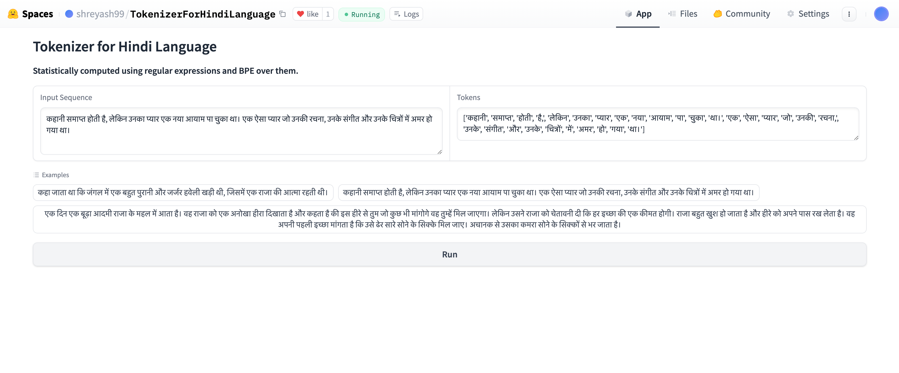

# Session 20 Assignment

## Problem Statement
1. Pick any "Indian" language of your choice
2. Build your own BPE for this language that satisfies these statistics:
    - it must have 5000+ tokens in its vocabulary
    - it must have a compression ratio of 3 or above
3. Once done:
    - Share your GitHub link where we can find the training notebook
    - Upload to HuggingFace (with examples) where we can run your tokenizer

## Results(language - Hindi)
1. Compression ratio = 10.64 with vocab size of 2256 tokens 
> tokens length: 70166 
> ids length: 6593 
> compression ratio: 10.64X 
2. [Hugging Face Application](https://huggingface.co/spaces/shreyash99/TokenizerForHindiLanguage)
3. Hugging Face Application Screenshot

## Methodology
1. First collected a dataset of around 10 stories in hindi language from different sites 
2. Then tried to use regex but the regex of GP2 or GPT4 isnt designed for hindi text and therefor it was misidentifying the punctuation part and was separating in between the words which is wrong.
3. As there are very less punctuation marks in hindi =(|, -) and there was also no use of 'll,'re etc as there are also not present. Therefore instead of figuring out my own regex which does not have these, i opted for a very simple splitting, based on the whitespace.
4. This splitting can be improved but for my usecase, it seemed okay, and i tried modifying the actual regex but because of lack of knowledge of regular expressions, it was difficult.
5. Then i took help of MinBPE library of Andrej Karpathy to get inspiration of the merge, encode and decode function which are used in case of list of input for this case.
6. Then iteratively merged tokens for 2000 times and statistically trained the tokenizer for hindi language.
7. Deployed the tokenized app on [hugging face Spaces](https://huggingface.co/spaces/shreyash99/TokenizerForHindiLanguage)